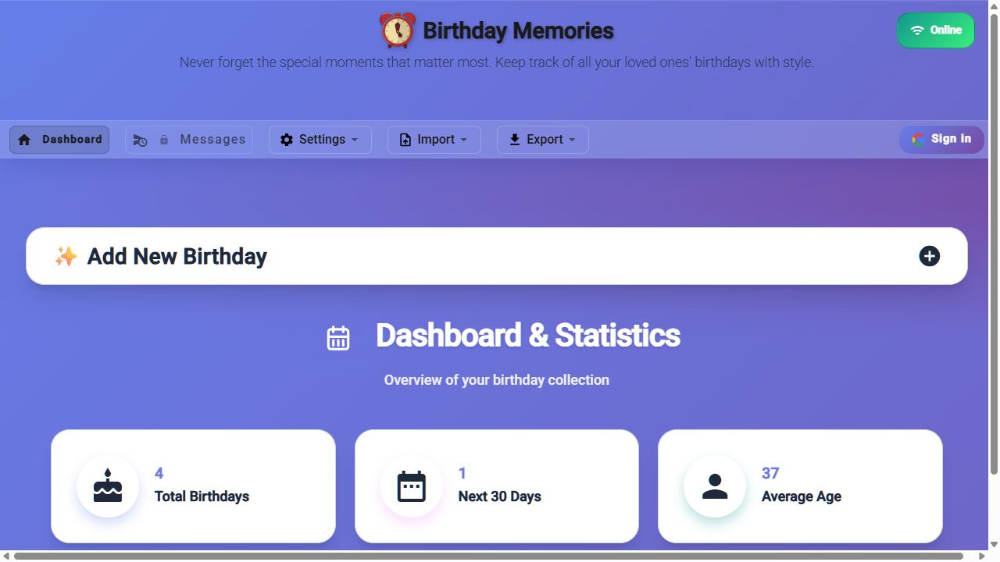
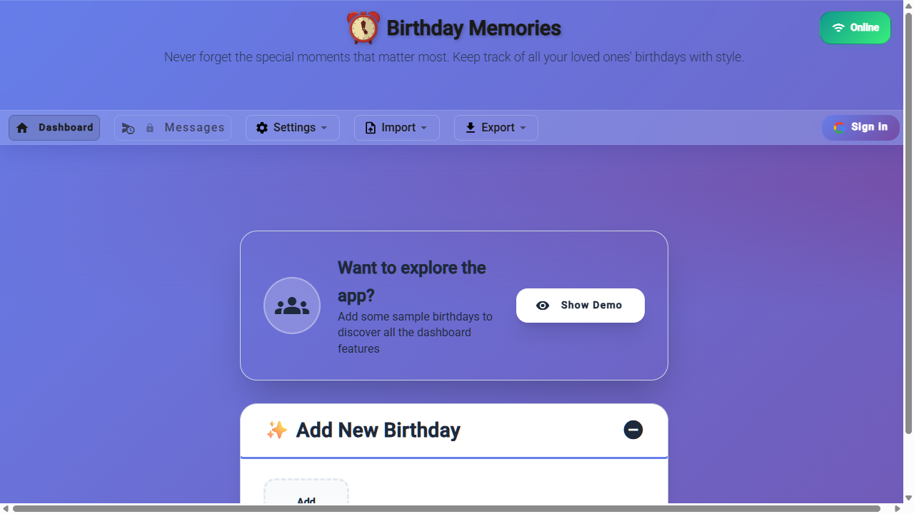
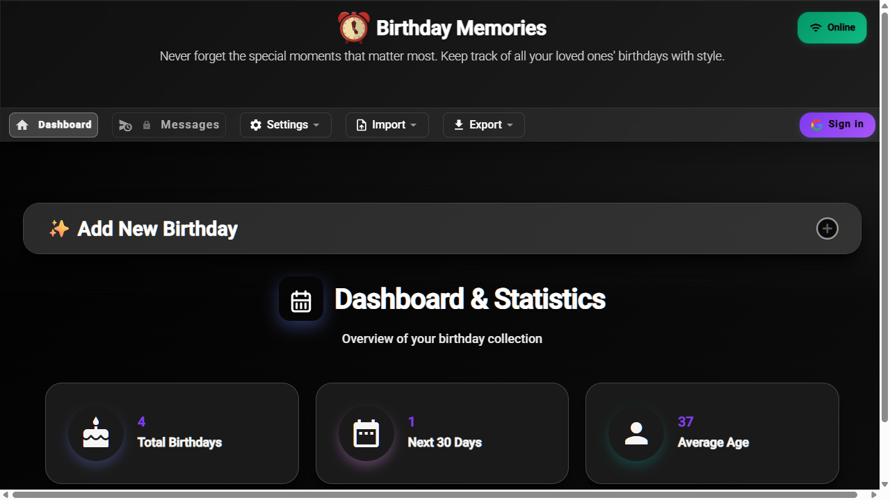
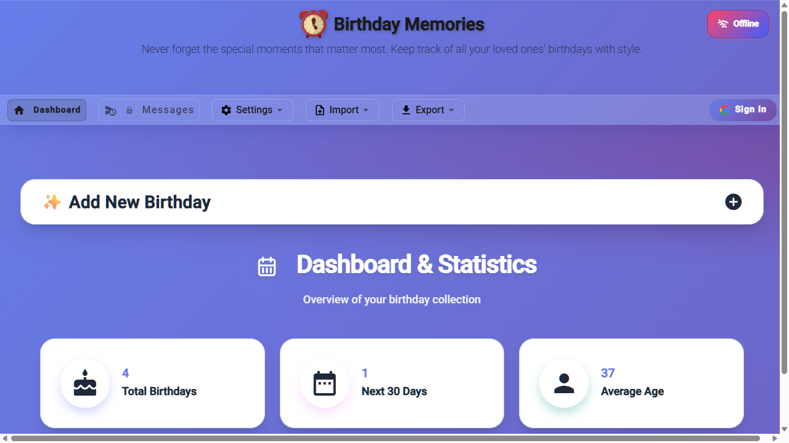

# Birthday Reminder App

A birthday management application built with Angular 19. Never forget a birthday again with calendar sync, notifications, and offline support.

[](https://github.com/MihaelaAghirculesei/birthday-reminder-app/actions/workflows/ci.yml)
[](https://angular.io/)
[](https://www.typescriptlang.org/)
[](https://capacitorjs.com/)
[](LICENSE)

---

## Table of Contents

- [About](#about)
- [Screenshots](#screenshots)
- [Features](#features)
- [Tech Stack](#tech-stack)
- [Architecture](#architecture)
- [Getting Started](#getting-started)
- [Build & Deployment](#build--deployment)
- [Testing](#testing)
- [Roadmap](#roadmap)
- [Contributing](#contributing)
- [License](#license)

---

## About

I built this app to practice NgRx state management and learn how to build offline-first applications. It's a personal project where I wanted to explore cross-platform development with Capacitor and Firebase.

The app manages birthdays with features like:
- Works offline using IndexedDB
- Optional cloud sync via Firebase Firestore (auth users only)
- Syncs with Google Calendar (one-way or two-way)
- Sends notifications on web and Android
- Exports/imports data in multiple formats
- Organizes contacts by categories

---

## Screenshots

| Dashboard | Birthday Form | Dark Mode |
|-----------|--------------|-----------|
|  |  |  |

| Category Filter | Stats & Chart | Sync Status |
|----------------|--------------|-------------|
|  |  |  |

> **Note for contributors / reviewers:** Screenshots are taken at `1280×800` with the app running locally (`npm start`). To regenerate them, run the app, use the test data generator (gear icon → "Load Test Data"), and capture the views above. Save as `.png` in `docs/screenshots/`.

---

## Features

**Birthday Management**
- Add, edit, delete birthdays with photos
- Categories for organizing (Family, Friends, Colleagues, etc.)
- Search and filter by name, category, or month
- Zodiac sign calculation
- Age tracking

**Notifications**
- Browser push notifications (using service workers)
- Native Android notifications (via Capacitor)
- Schedule custom messages with variables like `{name}`, `{age}`, `{zodiac}`
- Priority levels and message types (text/HTML)

**Google Calendar Integration**
- OAuth 2.0 authentication
- One-way or two-way sync
- Creates yearly recurring events
- Syncs updates and deletions
- Customizable reminders

**Data Management**
- Export: JSON, CSV
- Import: JSON, CSV, vCard
- Validates dates during import
- Backup and restore functionality

**Dashboard**
- Shows total birthdays and upcoming ones
- Average age calculation
- Next birthday countdown
- Monthly distribution chart
- Category statistics

**Cloud Sync (Firebase)**
- Google sign-in with Firebase Auth
- Real-time sync across devices via Firestore
- Photos uploaded to Firebase Storage CDN
- Firebase SDK is fully lazy — anonymous users pay zero cost
- Automatic migration of local-only data on first sign-in

**Offline Support**
- Works completely offline using IndexedDB
- Service worker caches assets
- Network status indicator
- Pending changes queued and synced when back online

**Accessibility**
- Screen reader support (tested with NVDA)
- Skip-to-content link
- ARIA labels and roles throughout
- axe-core automated accessibility checks (zero critical/serious violations)

**Other**
- Dark mode with automatic theme switching
- Undo last deletion
- Reassign categories in bulk
- Test data generator (40+ entries)
- Material Design UI
- Responsive design (still working on this)

---

## Tech Stack

**Frontend**
- Angular 19 (standalone components, Signals, SSR)
- TypeScript 5.8
- Angular Material 19
- RxJS 7.8.0

**State Management**
- NgRx 19 (Store, Effects, Entity adapters, Selectors)
- DevTools for debugging

**Mobile & PWA**
- Capacitor 7.4.4 for Android
- Angular Service Worker for offline caching
- @capacitor/local-notifications for native notifications

**Storage & Cloud**
- IndexedDB (offline-first source of truth)
- Firebase Auth + Firestore (cloud sync, auth users only)
- Firebase Storage (photo CDN, lazy-loaded)
- LocalStorage for settings

**External APIs**
- Google Calendar API v3 (one-way and two-way sync)
- Google OAuth 2.0

**Development**
- Angular CLI 19.x
- Karma & Jasmine (unit tests)
- Cypress 15 (E2E, visual regression, accessibility with cypress-axe)

---

## Architecture

> For a deep dive, see [ARCHITECTURE.md](ARCHITECTURE.md).

### State Management

Five NgRx slices:

```
AppState
├── birthdays: BirthdayState  (EntityState<Birthday> + filters + optimisticBackup)
├── categories: CategoryState (EntityState<Category>)
├── auth: AuthState           (user | null, loading, initialized)
├── sync: SyncStatus          (state, pendingChanges, lastSyncAt, isOnline)
└── ui: UIState               (theme, notifications, local UI flags)
```

### Data Flow

```
Component
  └─► dispatch(action)
        └─► Effects (side effects: IndexedDB, Firestore, APIs)
              └─► dispatch(*Success / *Failure)
                    └─► Reducer (pure state update)
                          └─► Selector (memoized)
                                └─► Component re-renders
```

### Offline-First

IndexedDB is the source of truth. Every write goes to IndexedDB first. Firestore is a cloud replica synced via a pending-changes queue. The app works fully offline; sync resumes automatically when back online.

### Component Structure

```
src/app/
├── core/                    # Singleton services, NgRx store
│   ├── store/              # actions, reducers, effects, selectors
│   └── services/           # domain, storage, auth, sync, notification services
├── features/               # Feature areas
│   ├── dashboard/          # Main UI (birthday list, stats, charts)
│   ├── calendar-sync/      # Google Calendar integration UI
│   ├── scheduled-messages/ # Message scheduling
│   └── home/               # Landing page
├── shared/                 # Reusable components, models, pipes, utils
└── layout/                 # Header component
```

---

## Getting Started

### Prerequisites

- Node.js 20.x or higher
- npm 10.x or higher
- Angular CLI 19.x (`npm install -g @angular/cli@^19`)
- Android Studio (optional, for Android build)

### Installation

1. **Clone the repository**
   ```bash
   git clone https://github.com/MihaelaAghirculesei/birthday-reminder-app.git
   cd birthday-reminder-app
   ```

2. **Install dependencies**
   ```bash
   npm install
   ```

3. **Configure Environment Files**

   Credentials live in a single gitignored `.env.local` file — `npm run env:init` (runs automatically before `npm start`/`npm run build`) reads it and generates `src/environments/environment.ts` / `environment.prod.ts`. Never edit those two generated files directly; they're overwritten on every `env:init` run.

   ```bash
   cp .env.local.example .env.local
   ```

   Leave `.env.local` with placeholder values and the app runs fully offline — no Google or Firebase account needed. Fill in the variables below to enable the optional integrations.

   > ⚠️ **Security Note**: `.env.local`, `environment.ts` and `environment.prod.ts` are all in `.gitignore` and should NEVER be committed.

4. **Configure Google Calendar API** (Optional)

   To enable Google Calendar synchronization:

   **a) Create Google Cloud Project:**
   - Go to [Google Cloud Console](https://console.cloud.google.com/)
   - Create a new project (e.g., "Birthday Reminder App")
   - Enable the **Google Calendar API**

   **b) Create OAuth 2.0 Credentials:**
   - Navigate to **APIs & Services** > **Credentials**
   - Click **Create Credentials** > **OAuth client ID**
   - Application type: **Web application**
   - Add authorized JavaScript origins:
     - Development: `http://localhost:4203`
     - Production: `https://your-domain.com`
   - Click **Create**

   **c) Set the client ID in `.env.local`:**

   The same OAuth client ID is used for both Calendar sync and Firebase Google Sign-In:
   ```bash
   GOOGLE_CLIENT_ID=YOUR_CLIENT_ID.apps.googleusercontent.com
   ```

   Re-run `npm run env:init` (or just restart `npm start`, which runs it via `prestart`) to regenerate the environment files.

5. **Configure Firebase** (Optional — for cloud sync and photo storage)

   Set the Firebase variables in `.env.local` (values from Firebase Console → Project settings → Your apps → Web app → Config):
   ```bash
   FIREBASE_API_KEY=YOUR_FIREBASE_API_KEY
   FIREBASE_AUTH_DOMAIN=YOUR_PROJECT_ID.web.app
   FIREBASE_PROJECT_ID=YOUR_PROJECT_ID
   FIREBASE_STORAGE_BUCKET=YOUR_PROJECT_ID.firebasestorage.app
   FIREBASE_MESSAGING_SENDER_ID=YOUR_MESSAGING_SENDER_ID
   FIREBASE_APP_ID=YOUR_APP_ID
   ```
   > **Tip**: Leave these unset and the app auto-detects the missing config and runs in offline-only mode — no Firebase account needed to run the app locally. All six `FIREBASE_*` variables are required together for `env:init` to wire up Firebase; partial config falls back to offline mode.

### Development Server

```bash
npm start
```

Navigate to `http://localhost:4203/`. The app will reload automatically on file changes.

---

## Build & Deployment

### Web Build (PWA)

Build for production:

```bash
ng build --configuration production
```

The build artifacts will be stored in the `dist/` directory.

### Android Build

1. **Build the web app**
   ```bash
   ng build --configuration production
   ```

2. **Sync with Capacitor**
   ```bash
   npx cap sync android
   ```

3. **Open in Android Studio**
   ```bash
   npx cap open android
   ```

4. **Build APK/AAB** in Android Studio

### Server-Side Rendering (SSR)

Build and run with SSR locally:

```bash
ng build
npm run serve:ssr:birthday-reminder-pro
```

For production on Cloudflare Pages, the pre-rendered static files are served directly — no Node.js server required.

---

## Project Structure

```
birthday-reminder-app/
├── src/app/
│   ├── core/               # Singleton services, NgRx store slices
│   │   ├── services/       # Facades, storage, auth, sync, notifications
│   │   └── store/          # Actions, reducers, effects, selectors (birthday, category, auth, sync, ui)
│   ├── features/           # Feature areas
│   │   ├── dashboard/      # Main UI: birthday list, stats, charts, category filter
│   │   ├── calendar-sync/  # Google Calendar integration
│   │   └── scheduled-messages/ # Message scheduling
│   ├── shared/             # Reusable components, models, pipes, utils
│   └── layout/             # Header component
├── cypress/
│   └── e2e/                # E2E, visual regression, accessibility tests
└── android/                # Capacitor Android project
```

---

## Roadmap

**Done**
- Core CRUD operations
- NgRx state management
- Google Calendar sync
- Push notifications (web + Android)
- Offline support with IndexedDB
- Import/export (JSON, CSV, vCard)
- Categories
- Dashboard with stats and charts
- Message scheduling
- Photo uploads
- PWA with service worker
- Unit tests (Jasmine/Karma)
- E2E tests (Cypress, CI-ready)
- Visual regression snapshots
- Accessibility (NVDA, axe-core)

**Working on**
- Responsive design

**Future ideas**
- i18n support
- iOS app
- Cloud backup
- Birthday wish templates
- Gift tracking

---

## Testing

**Unit tests** (Karma/Jasmine):
```bash
ng test
ng test --code-coverage
```

**E2E tests** (Cypress):
```bash
npm run e2e          # standard E2E suite
npm run e2e:visual   # visual regression snapshots
```

The E2E suite covers: IndexedDB as source of truth, network error handling, and accessibility (axe-core, zero critical/serious violations).

### Running the full CI pipeline locally

`npm run ci:local` chains every check the GitHub Actions workflow runs, in the same order, so a red pipeline is never a surprise:

```bash
npm run ci:local
# = validate:ci   → sanity-checks the CI workflow config itself
#   ci:security   → npm audit --omit=dev --audit-level=high
#   ci:quality    → lint + typecheck (app and specs)
#   test:ci       → unit tests with coverage thresholds
#   e2e:ci        → boots the app on the ci config, runs the Cypress suite headlessly
#   ci:build      → production build + ci:bundle (fails if the main bundle exceeds 500 KB)
```

Each step can also be run standalone (`npm run ci:quality`, `npm run ci:build`, etc.) when iterating on a single failure instead of the whole chain. `npm run analyze` builds with `--stats-json` and prints the largest output chunks with their top contributing source modules (`scripts/analyze-bundle.js`) — it reads esbuild's own metafile directly rather than `webpack-bundle-analyzer`, which doesn't understand it (Angular 17+ moved off Webpack for production builds).

---

## Contributing

This is a personal learning project, but suggestions are welcome! Feel free to open an issue or PR — see [CONTRIBUTING.md](CONTRIBUTING.md) for setup, the pre-PR checklist, and commit conventions.

---

## License

This project is licensed under the MIT License - see the [LICENSE](LICENSE) file for details.

---

## Author

**Mihaela Melania Aghirculesei**
- Portfolio: [aghirculesei.pages.dev](https://aghirculesei.pages.dev/)
- GitHub: [@MihaelaAghirculesei](https://github.com/MihaelaAghirculesei)
- LinkedIn: [mihaela-aghirculesei](https://www.linkedin.com/in/mihaela-aghirculesei/)

---

## Built With

- [Angular](https://angular.io/)
- [NgRx](https://ngrx.io/)
- [Angular Material](https://material.angular.io/)
- [Firebase](https://firebase.google.com/) (Auth, Firestore, Storage)
- [Capacitor](https://capacitorjs.com/)
- [Google Calendar API](https://developers.google.com/calendar)
- [Cypress](https://www.cypress.io/) + [cypress-axe](https://github.com/component-driven/cypress-axe)

---

## Known Issues

- Some transitions could be smoother
- Google Calendar re-authentication after token expiry

### WebSocket errors during E2E tests
When running `npm run ci:local` you may see errors like:

```
Cannot establish a connection with the server ws://localhost:4203/
```

These errors are **normal and expected** - they occur because the dev server is terminated after the tests, but the browser keeps trying to maintain the WebSocket connection. The tests have still passed successfully.

---

**Note:** This is a learning project I built to practice NgRx and offline-first architecture. Feel free to check out the code!
